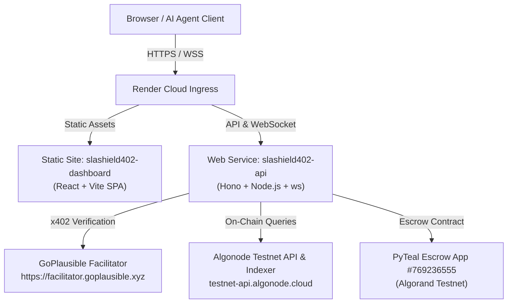

# SLAShield402 — Production Deployment Guide (Render)

This guide provides step-by-step instructions for deploying SLAShield402 as a full-stack application on [Render](https://render.com).

---

## Deployment Architecture



---

## Option 1: One-Click Blueprint Deployment (Recommended)

SLAShield402 includes a `render.yaml` Blueprint that automatically provisions both the Backend Web Service and Frontend Static Site.

1. Log in to [Render Dashboard](https://dashboard.render.com).
2. Click **New +** → **Blueprint**.
3. Connect the repository `Vishal-VK18/SLAShield402`.
4. Render will parse `render.yaml` and configure:
   - **`slashield402-api`** (Node Web Service)
   - **`slashield402-dashboard`** (Static Site with SPA rewrite rules)
5. Fill in the secret environment variable:
   - `DEPLOYER_MNEMONIC`: Your 25-word Algorand Testnet mnemonic.
6. Click **Apply**.

---

## Option 2: Manual Service Creation on Render

If creating services manually via the Render UI:

### 1. Backend Web Service (`slashield402-api`)
- **Service Type**: Web Service
- **Runtime**: `Node`
- **Build Command**: `npm install`
- **Start Command**: `npm start`
- **Health Check Path**: `/health`
- **Environment Variables**:
  | Variable Name | Recommended Value / Description |
  |---|---|
  | `PORT` | `10000` |
  | `HOST` | `0.0.0.0` |
  | `SLASHIELD_RECIPIENT_ADDRESS` | `YVEHNV3EWF4GULZHABH64QKOYLE5MO2MSBAAK7O76A2ESACA5OV2AZSOKQ` |
  | `SLASHIELD_ESCROW_APP_ID` | `769236555` |
  | `USDC_ASA_ID` | `10458941` |
  | `FACILITATOR_URL` | `https://facilitator.goplausible.xyz` |
  | `ALGOD_SERVER` | `https://testnet-api.algonode.cloud` |
  | `ALGOD_PORT` | `443` |
  | `INDEXER_SERVER` | `https://testnet-idx.algonode.cloud` |
  | `INDEXER_PORT` | `443` |
  | `DEPLOYER_MNEMONIC` | *(Your 25-word mnemonic)* |

### 2. Frontend Static Site (`slashield402-dashboard`)
- **Service Type**: Static Site
- **Root Directory**: `dashboard`
- **Build Command**: `npm install && npm run build`
- **Publish Directory**: `./dist`
- **Rewrite Rules**:
  - `Source`: `/*`
  - `Destination`: `/index.html`
- **Environment Variables**:
  | Variable Name | Recommended Value |
  |---|---|
  | `VITE_API_URL` | `https://slashield402-api.onrender.com` *(your deployed API URL)* |

---

## Verification After Deployment

### 1. Backend Health Check
```bash
curl -i https://<your-api-url>.onrender.com/health
```
**Expected Response**:
```json
HTTP/1.1 200 OK
Content-Type: application/json

{"status":"OK","uptime":...,"timestamp":"..."}
```

### 2. Live x402 Challenge
```bash
curl -i -X POST https://<your-api-url>.onrender.com/shield/check \
  -H "Content-Type: application/json" \
  -d '{"target_api":"https://api.weather.algo/v1","offer_price":0.02,"agent_budget_left":1.0}'
```
**Expected Response**:
```text
HTTP/1.1 402 Payment Required
WWW-Authenticate: x402 realm="SLAShield402", amount="0.001", currency="USDC", network="algorand-testnet"...
```

### 3. Frontend WebSocket & Telemetry
Open `https://<your-dashboard-url>.onrender.com` in a web browser:
- Header network status shows `algorand-testnet`.
- Live WebSocket indicator shows `LIVE SYNC`.
- Wallet balance loads live from Algorand Testnet node.
