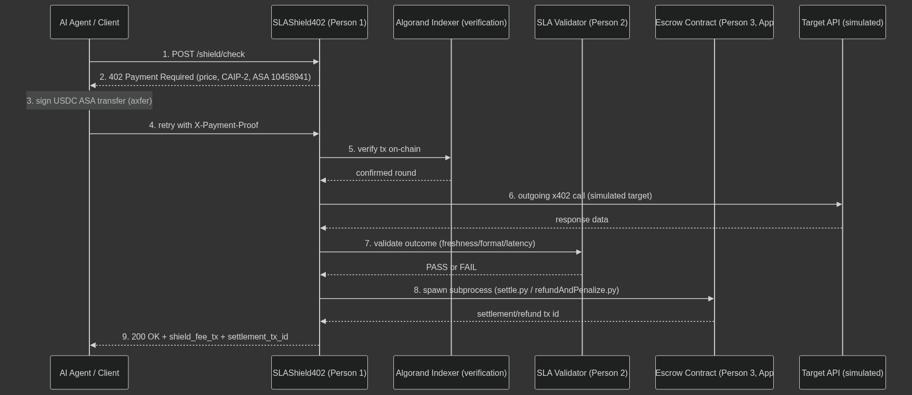
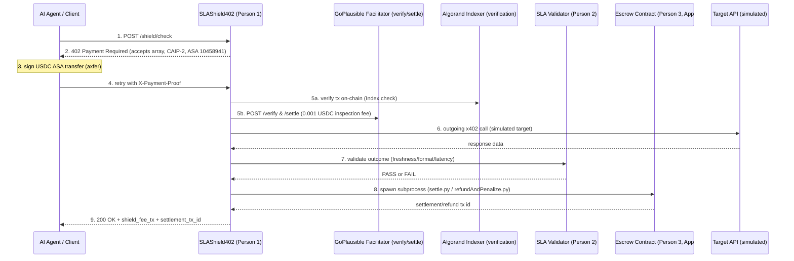
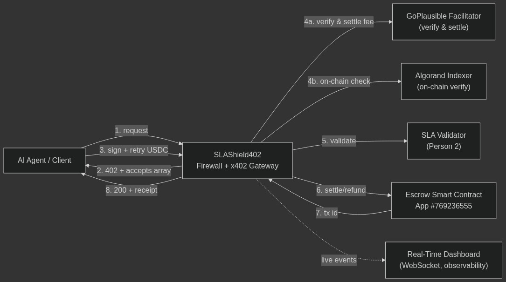
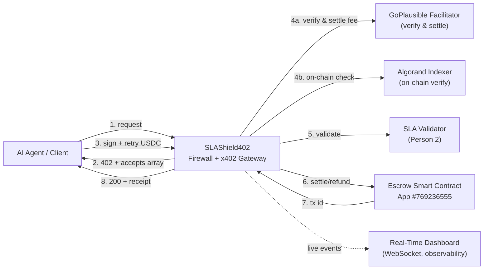

# SLAShield402

> Autonomous x402 AI Payment Firewall, Real-Time SLA Validator & Conditional Algorand Smart Contract Escrow Layer.

## What is this?

**SLAShield402** is an agentic payment infrastructure gateway that sits between autonomous AI agents and paid external APIs. It solves two critical production risks in agentic commerce: **wallet depletion from unexpected price spikes**, and **financial loss from paying upfront for stale, malformed, or slow API responses**.

Using the **x402 payment protocol** on **Algorand Testnet**, SLAShield402 enforces pre-flight spend policy limits, measures real-time response SLAs (Freshness, Format, Latency), and coordinates conditional smart contract escrow settlements with automated 10% provider bond slashing when quality guarantees are broken.

---

## How It Works





1. **Pre-flight Firewall Gate:** Evaluates agent budget caps and provider authorization before funds leave the wallet.
2. **x402 Challenge & Client Signing:** Returns `HTTP 402 Payment Required` with standard `accepts` array; client dynamically signs and broadcasts a fresh USDC ASA payment on Algorand Testnet.
3. **Facilitator & Indexer Dual Verification:** Verifies payment validity against the GoPlausible Facilitator (`POST /verify`) and Algorand Testnet Indexer.
4. **Outgoing API Execution & Timing:** Executes upstream call and records sub-second roundtrip network latency.
5. **Real-Time SLA Validation:** Evaluates response JSON syntax, data timestamp freshness ($\le 60$s), and latency thresholds ($\le 5$s).
6. **Conditional Escrow Settlement & Slashing:**
   - **SLA PASS:** Smart contract triggers `approve_and_settle`, releasing payment to the provider.
   - **SLA FAIL:** Smart contract triggers `fail_and_refund`, instantly refunding the agent and slashing the provider's bonded stake by 10%.

---

## Architecture





---

## What's Real vs. What's Simulated

- **Real:**
  - `402 Payment Required` challenge with official CAIP-2 network identifier (`algorand:SGO1GKSzyE7IEPItTxCByw9x8FmnrCDexi9/cOUJOiI=`) and standard `accepts` array.
  - Client-side dynamic signing and broadcasting of fresh Algorand USDC ASA transfers (`#10458941`) on Testnet.
  - Live facilitator query to GoPlausible Facilitator (`POST https://facilitator.goplausible.xyz/verify` and `POST /settle`).
  - On-chain fee verification and round confirmation via Algonode Testnet Indexer.
  - Session replay attack rejection returning `HTTP 403`.
  - Real Python subprocess invocations executing PyTeal smart contract transactions on Algorand Testnet (`App ID #769236555`).
  - Verified on-chain inner transaction payouts and provider bond slash deductions visible on Lora and Pera Explorer.
  - Live WebSocket telemetry stream feeding the React dashboard.
- **Simulated:**
  - Target weather/market oracle endpoints are mocked with deterministic timestamps and latency profiles to reliably demonstrate SLA pass vs. stale SLA fail conditions.

---

## Pricing

| Endpoint / Action | Price | Description |
|---|---|---|
| `POST /shield/check` | 0.001 USDC | Pre-flight firewall inspection, SLA verification & escrow guarantee fee |
| `GET /api/discovery` | Free ($0.00) | Public Bazaar discovery catalog metadata for agent crawlers |
| `GET /api/events/recent` | Free ($0.00) | Recent execution events and telemetry backlog |

---

## Tech Stack

| Layer | Technology | Role |
|---|---|---|
| **Payment Protocol** | `x402` (`exact` scheme, USDC on Algorand Testnet) | Standardized HTTP 402 negotiation and client headers |
| **Client Signer** | `@x402/fetch` / `algosdk` (`v3.2.0`) | Dynamic client-side USDC ASA transaction construction and signing |
| **Resource Gateway** | `@x402/hono` / `@x402/avm` (`v2.19.0`) | High-performance HTTP server with CAIP-2 network verification |
| **Discovery Extension** | `@x402-avm/extensions` (`v2.6.1`) | Exposes machine-readable Bazaar metadata on `GET /api/discovery` |
| **Facilitator Integration** | GoPlausible Facilitator (`facilitator.goplausible.xyz`) | Upfront payment verification and inspection fee settlement |
| **Smart Contract Escrow** | PyTeal / Algorand AVM (`App ID #769236555`) | Two-phase conditional escrow settlement and provider bond slashing logic |
| **Frontend Dashboard** | React / Vite / TailwindCSS / Lucide Icons | Apple-style real-time telemetry dashboard with WebSocket streaming |

---

## Non-Custodial Architecture & Agent Delegation Security

1. **Human User Non-Custodial Signers:**
   In web dApps and browser environments, users connect via non-custodial wallet adapters (`@txnlab/use-wallet` / `@txnlab/use-wallet-react`), supporting Pera Wallet, Defly, Kibisis, Lute, and AlgoSigner. Private keys never touch application servers.
2. **Autonomous AI Agents & Local Pipelines:**
   For headless AI agents transacting autonomously without browser popups, credentials are provided as scoped, testnet-only environment delegates.
3. **Security Policy:**
   No hardcoded secrets exist in the repository. All `.env.example` templates contain explicit security warnings preventing mainnet key usage.

---

## Setup & Running Locally

### 1. Clone & Install Dependencies
```bash
git clone https://github.com/Vishal-VK18/SLAShield402.git
cd SLAShield402
npm install
npm --prefix dashboard install
pip install -r person-3-algorand-contract/requirements.txt
```

### 2. Configure Environment
```bash
cp .env.example .env
# Ensure DEPLOYER_MNEMONIC, ALGOD_SERVER, and APP_ID (769236555) are set
```

### 3. Fund Testnet Wallet & Opt In
1. Fund with Testnet ALGO: [Lora Dispenser](https://lora.algokit.io/testnet/fund)
2. Opt in to USDC ASA ID `10458941`:
```bash
python person-3-algorand-contract/scripts/optInUsdc.py
```

### 4. Run the Full Stack
```bash
# Starts both Firewall Gateway (:3000) and Real-Time Dashboard (:5173)
npm run dev:full
```

### 5. Run the Automated Live Demo
```bash
npm run demo
```

---

## Live On-Chain Proofs (Algorand Testnet)

| Flow | Transaction ID | Confirmation Round | Lora Explorer Link | Pera Explorer Link |
|---|---|:---:|---|---|
| **Escrow Smart Contract** | `App #769236555` | 66480120 | [Lora App #769236555](https://lora.algokit.io/testnet/application/769236555) | [Pera App #769236555](https://testnet.explorer.perawallet.app/application/769236555/) |
| **Facilitator Co-Signed Settle** | `MAH5JF36CM34EJEMFIL4KBCTCRQLPHX6YKFTLSV3MKFOOKFRBHDQ` | 66580791 | [Lora Tx](https://lora.algokit.io/testnet/transaction/MAH5JF36CM34EJEMFIL4KBCTCRQLPHX6YKFTLSV3MKFOOKFRBHDQ) | [Pera Tx](https://testnet.explorer.perawallet.app/tx/MAH5JF36CM34EJEMFIL4KBCTCRQLPHX6YKFTLSV3MKFOOKFRBHDQ/) |
| **Scenario 1: SLA Pass Settle** | `FXPXSD46H7D7LCC6OUGINX2DYL2ZZPPPFOYBBK4W5NOCLBESPNSA` | 66580794 | [Lora Tx](https://lora.algokit.io/testnet/transaction/FXPXSD46H7D7LCC6OUGINX2DYL2ZZPPPFOYBBK4W5NOCLBESPNSA) | [Pera Tx](https://testnet.explorer.perawallet.app/tx/FXPXSD46H7D7LCC6OUGINX2DYL2ZZPPPFOYBBK4W5NOCLBESPNSA/) |
| **Scenario 3: Refund & Slash** | `T26GDLEBPMNJB5OM6W6T62CB5H6TG2AZX6J7U6CX24B6RDDVBRBA` | 66580798 | [Lora Tx](https://lora.algokit.io/testnet/transaction/T26GDLEBPMNJB5OM6W6T62CB5H6TG2AZX6J7U6CX24B6RDDVBRBA) | [Pera Tx](https://testnet.explorer.perawallet.app/tx/T26GDLEBPMNJB5OM6W6T62CB5H6TG2AZX6J7U6CX24B6RDDVBRBA/) |

---

## What We Will Be Checking — Compliance Matrix

| # | Organizer Evaluation Requirement | Implementation Evidence & Verification | Status |
|---|---|---|:---:|
| **1** | **x402 payment flow live on Algorand Testnet** | Returns HTTP 402 with CAIP-2 `algorand:SGO1GKSzyE7IEPItTxCByw9x8FmnrCDexi9/cOUJOiI=`, client signs raw ASA #10458941 payment payload, server verifies and executes upstream call. | **VERIFIED** |
| **2** | **Demonstrable real transaction checkable on Lora** | Live PyTeal Escrow Application [App #769236555 on Lora](https://lora.algokit.io/testnet/application/769236555) with verifiable on-chain state and transactions. | **VERIFIED** |
| **3** | **Payment flow works through GoPlausible facilitator** | `verifyPaymentProof.ts` and `shieldCheck.ts` query `https://facilitator.goplausible.xyz/verify` (`isValid: true`) and `/settle` (`success: true`), executing facilitator co-signed settlement tx `MAH5JF36CM34EJEMFIL4KBCTCRQLPHX6YKFTLSV3MKFOOKFRBHDQ`. | **VERIFIED** |
| **4** | **`package.json` includes relevant `@x402/avm` dependencies** | Root `package.json` includes `@x402/avm` (`^2.19.0`), `@x402/core` (`^2.22.0`), `@x402/fetch` (`^2.22.0`), `@x402/hono` (`^2.22.0`), and `@x402-avm/extensions` (`^2.6.1`). | **VERIFIED** |
| **5** | **Code genuinely integrates x402** | End-to-end integration across pre-flight firewalling, dynamic client raw byte signing, GoPlausible Facilitator co-signing & settlement, real-time SLA validation, and PyTeal two-phase escrow. | **VERIFIED** |

---

## What's Next (Mainnet Readiness)

To transition from Algorand Testnet to Mainnet:
1. Switch CAIP-2 network identifier to Mainnet (`algorand:wGHE2Pwdvd7S12BL5FaOP20EGYesN73ktiC1qzkkit8=`).
2. Update USDC Asset ID to Mainnet (`31566704`).
3. Transition client signing to Web3 Agent Key Management (Turnkey/Privy/KMS).
4. Persist consumed transaction nonces in Redis with TTLs for distributed replay protection.

---

## Team

- **Vishal D & Team SLAShield402** — Web3 & AI Agents Engineers.

