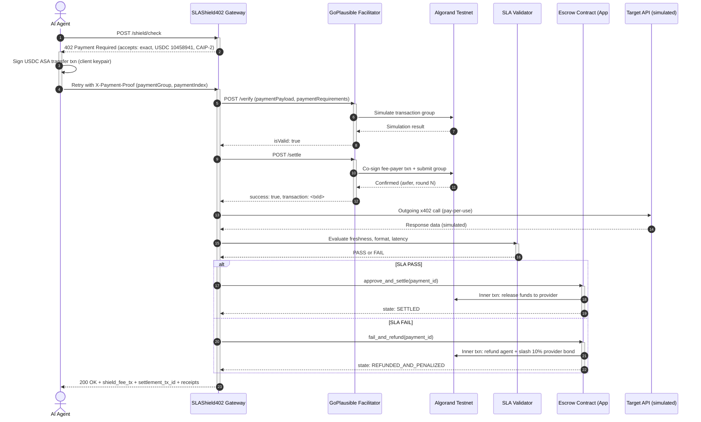
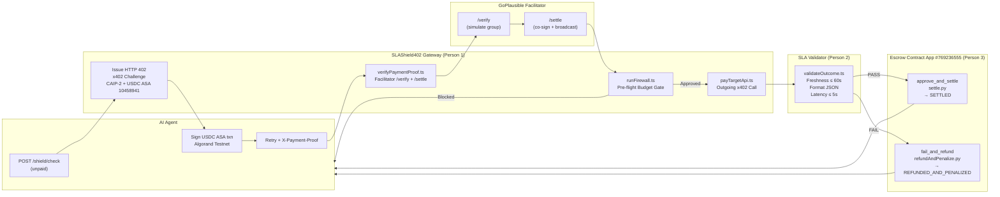

# SLAShield402

**Team ARYA — x402 Global Challenge, Bengaluru**

SLAShield402 is an autonomous AI agent payment firewall and SLA settlement layer built on the x402 protocol and Algorand Testnet. When an AI agent attempts to call a paid data API, SLAShield intercepts the request, issues an HTTP 402 challenge requiring 0.001 USDC in Circle's ASA (ID `10458941`) via the GoPlausible gasless facilitator, enforces pre-flight budget guardrails, validates the provider's SLA (freshness, format, latency), and atomically settles or slashes provider bond through a PyTeal escrow smart contract (App `#769236555`) — all without the agent paying Algorand gas fees directly.

---

## Team

| Name | Role |
|---|---|
| Vishal D | Algorand Smart Contract & Escrow (Person 3 — `person-3-algorand-contract/`) |
| Vigneshwaran V | x402 Gateway, Firewall & Facilitator Client (Person 1 — `person-1-firewall-api/`) |
| Arvin M | SLA Outcome Validator (Person 2 — `person-2-sla-validator/`) |

---

## The Problem

Autonomous AI agents need to pay for real-time data APIs on-the-fly, but have no protection against overpriced providers, stale data, or malicious APIs draining their budgets. Existing payment schemes settle unconditionally — there is no mechanism to enforce service-level agreements or claw back funds when a provider fails to deliver.

---

## The Solution

SLAShield402 places a smart firewall between the agent and any paid API. The firewall enforces pre-flight budget checks, handles HTTP 402 payment negotiation through the GoPlausible facilitator's gasless atomic group co-signing, validates real-time SLA criteria after the response arrives, and executes conditional on-chain settlement — releasing funds on SLA pass or refunding the agent and slashing the provider's bonded stake on SLA failure.

---

## How It Works — Sequence Diagram



---

## Architecture Overview



---

## What's Real vs. Simulated

| Component | Status | Notes |
|---|---|---|
| x402 HTTP 402 challenge / retry protocol | **Real** | Full `WWW-Authenticate` header + JSON body per x402 v2 spec |
| GoPlausible Facilitator `/verify` + `/settle` | **Real** | Live calls to `https://facilitator.goplausible.xyz`, co-signed atomic group confirmed on-chain |
| USDC payment (Circle ASA `10458941`) | **Real** | 1000 micro-units (0.001 USDC) transferred on Algorand Testnet in group `Y4GlVlrop1Meswkp2JDbtY85nK0/wawmp+nX/FTCjVY=` |
| Algorand Testnet escrow smart contract | **Real** | App `#769236555`, PyTeal, `approve_and_settle` and `fail_and_refund` confirmed on-chain |
| Pre-flight spend policy firewall | **Real** | `runFirewall.ts` enforces budget, price ceiling, provider allowlist |
| SLA validation (freshness, format, latency) | **Real** | `validateOutcome.ts` measures against live response timestamps |
| Target data API (weather/oracle provider) | **Simulated** | Responses are mocked; real money flow and contract calls are live |
| Real-time dashboard | **Real** | Vite + React 18 + WebSocket event bus at `ws://localhost:3000/ws` |

---

## Live Testnet Proof

All transactions independently confirmed via Algorand Testnet Indexer (`testnet-idx.algonode.cloud`).

| Proof | Transaction ID | Confirmed Round | Lora | Pera |
|---|---|---|---|---|
| **Facilitator verify+settle (0.001 USDC real fee)** | `VBC6WVDSRFRLMFL7RD3Q7L7I3A3FHXTKCYWPZJAIO2SHYPC5V2VA` | 66582509 | [Lora](https://lora.algokit.io/testnet/transaction/VBC6WVDSRFRLMFL7RD3Q7L7I3A3FHXTKCYWPZJAIO2SHYPC5V2VA) | [Pera](https://testnet.explorer.perawallet.app/tx/VBC6WVDSRFRLMFL7RD3Q7L7I3A3FHXTKCYWPZJAIO2SHYPC5V2VA/) |
| **Fee-payer co-sign tx in same group** | `IRPZGM6FWUGSJEJPQRCYOBWIKZVZAWUJSA6DYS4NAMD6LOKQWEZQ` | 66582509 | [Lora](https://lora.algokit.io/testnet/transaction/IRPZGM6FWUGSJEJPQRCYOBWIKZVZAWUJSA6DYS4NAMD6LOKQWEZQ) | [Pera](https://testnet.explorer.perawallet.app/tx/IRPZGM6FWUGSJEJPQRCYOBWIKZVZAWUJSA6DYS4NAMD6LOKQWEZQ/) |
| **Escrow SLA pass → `approve_and_settle`** | `6X4BZTDNI35MHBDXAXOKXISYS34YW3DP2YBUOEP3GXXSOB6Z3IRA` | 66586427 | [Lora](https://lora.algokit.io/testnet/transaction/6X4BZTDNI35MHBDXAXOKXISYS34YW3DP2YBUOEP3GXXSOB6Z3IRA) | [Pera](https://testnet.explorer.perawallet.app/tx/6X4BZTDNI35MHBDXAXOKXISYS34YW3DP2YBUOEP3GXXSOB6Z3IRA/) |
| **Escrow SLA fail → `fail_and_refund` + slash** | `T26GDLEBPMNJB5OM6W6T62CB5H6TG2AZX6J7U6CX24B6RDDVBRBA` | 66580803 | [Lora](https://lora.algokit.io/testnet/transaction/T26GDLEBPMNJB5OM6W6T62CB5H6TG2AZX6J7U6CX24B6RDDVBRBA) | [Pera](https://testnet.explorer.perawallet.app/tx/T26GDLEBPMNJB5OM6W6T62CB5H6TG2AZX6J7U6CX24B6RDDVBRBA/) |
| Facilitator mechanism verification (zero-value, secondary proof) | `MAH5JF36CM34EJEMFIL4KBCTCRQLPHX6YKFTLSV3MKFOOKFRBHDQ` | 66580785 | [Lora](https://lora.algokit.io/testnet/transaction/MAH5JF36CM34EJEMFIL4KBCTCRQLPHX6YKFTLSV3MKFOOKFRBHDQ) | [Pera](https://testnet.explorer.perawallet.app/tx/MAH5JF36CM34EJEMFIL4KBCTCRQLPHX6YKFTLSV3MKFOOKFRBHDQ/) |

**Escrow Smart Contract:** App `#769236555` — [Lora App](https://lora.algokit.io/testnet/application/769236555)

**Facilitator fee-payer address:** `ZMFK2OI7ZBD2U27ISERZC4S6LKM6WMFJPZQ4MYNJDZ2VNBNMBA67RA22AA`

**CAIP-2 Network Identifier:** `algorand:SGO1GKSzyE7IEPItTxCByw9x8FmnrCDexi9/cOUJOiI=`

---

## Why We Use Our Own Escrow Alongside the Facilitator

The GoPlausible facilitator handles the gasless atomic co-signing of the USDC payment group — that is, the agent pays zero Algorand gas directly, and the facilitator's fee-payer wallet sponsors the group transaction. However, the facilitator only handles payment proof and settlement of the shield fee itself. SLAShield's additional escrow contract (`#769236555`) serves an orthogonal purpose: it holds the provider's bonded stake and conditionally releases or slashes it based on SLA outcome *after* the response has been received and validated. This two-layer model means the agent gets both a gasless payment flow (via facilitator) and a cryptographic guarantee that a provider who delivers stale or malformed data loses part of their bonded stake — a commitment the GoPlausible facilitator protocol alone does not enforce.

---

## Tech Stack

| Layer | Technology | Version |
|---|---|---|
| x402 Protocol Core | `@x402/core`, `@x402/avm`, `@x402/hono`, `@x402/fetch` | `^2.22.0` |
| x402 AVM Extensions | `@x402-avm/extensions` | `^2.6.1` |
| Algorand SDK (TypeScript) | `algosdk` | `^3.7.0` |
| API Gateway Framework | `hono` + `@hono/node-server` | `^4.13.2` / `^2.1.1` |
| Smart Contract Language | PyTeal | `^0.27.0` |
| Algorand Python SDK | `py-algorand-sdk` | `^2.11.0` |
| AlgoKit Utils | `algokit-utils` | `^4.0.0` |
| Dashboard Frontend | React 18 + Vite + Tailwind CSS | `^18.3.1` / `^6.1.0` / `^3.4.17` |
| Runtime | Node.js + TSX | `tsx ^4.23.12` |
| Testnet RPC | Algonode public API | `testnet-api.algonode.cloud` |
| Facilitator | GoPlausible | `https://facilitator.goplausible.xyz` |

---

## Setup & Run

### Prerequisites

- Node.js ≥ 20
- Python 3.12
- Poetry (`pip install poetry`)

### 1. Install dependencies

```bash
# Root workspace (TypeScript backend + frontend)
npm install

# Dashboard
npm install --prefix dashboard

# Python smart contract environment
cd person-3-algorand-contract
poetry install
cd ..
```

### 2. Configure environment

```bash
# Copy and fill root .env
cp .env.example .env

# Copy and fill contract .env
cp person-3-algorand-contract/.env.example person-3-algorand-contract/.env
```

Required variables:
```env
# .env (root)
DEPLOYER_MNEMONIC=<25-word mnemonic>
SLASHIELD_RECIPIENT_ADDRESS=YVEHNV3EWF4GULZHABH64QKOYLE5MO2MSBAAK7O76A2ESACA5OV2AZSOKQ
SLASHIELD_ESCROW_APP_ID=769236555
USDC_ASA_ID=10458941
FACILITATOR_URL=https://facilitator.goplausible.xyz
```

### 3. Run the full stack

```bash
# Starts backend (port 3000) + dashboard (port 5173) concurrently
npm run dev:full
```

Open **http://localhost:5173**

### 4. Run individual services

```bash
# Backend API only
npm run dev:person-1

# Dashboard only
npm run dev:dashboard

# Run demo scenarios (Scenario 1: Settle / Scenario 3: Refund+Slash)
npm run demo
```

### 5. Run tests

```bash
npm test
```

---

## Pricing

| Service | Fee | Currency |
|---|---|---|
| Shield check (firewall + SLA validation) | 0.001 | USDC (ASA `10458941`) |
| Algorand gas (agent-side) | 0 | Covered by GoPlausible Facilitator fee-payer |
| Provider bond slash (SLA failure penalty) | 10% of bonded stake | Algorand (inner txn) |

---

## Known Limitations

1. **Replay protection is in-memory only.** The `consumedTxIds` set in `verifyPaymentProof.ts` resets on server restart. A production deployment would persist this to a database or on-chain state.

2. **Shared wallet / mnemonic in `.env`.** All three team members share a single Algorand Testnet wallet for hackathon convenience. A production deployment would use separate wallets per service with proper key management.

3. **Mnemonic stored in `.env` file.** Private key material is in a `.env` file (gitignored). A production deployment would use a secrets manager or HSM.

4. **Target data APIs are simulated.** The weather and oracle provider APIs that agents call are mocked responses. The x402 payment flow, escrow contract, and facilitator calls are real — only the upstream data is synthetic.

5. **No public Bazaar registration.** The `GET /api/discovery` endpoint returns valid x402 Bazaar-compatible metadata (via `declareDiscoveryExtension`), but the service is not yet registered in the public GoPlausible Bazaar directory.

6. **Single-party escrow.** The smart contract currently trusts the gateway as the sole authorized caller for `approve_and_settle` / `fail_and_refund`. A production system would require multi-party oracle consensus.

---

## Hackathon Requirements Checklist

| # | Requirement | Status | Evidence |
|---|---|---|---|
| 1 | **Uses x402 protocol standard** | ✅ VERIFIED | `POST /shield/check` returns `HTTP 402` with `WWW-Authenticate: x402 realm=...` header, v2 JSON challenge body, and `X-Payment-Proof` retry per x402 spec. Implemented in `shieldCheck.ts` + `signPaymentProof.ts`. |
| 2 | **Algorand Testnet** | ✅ VERIFIED | All transactions on `algorand:SGO1GKSzyE7IEPItTxCByw9x8FmnrCDexi9/cOUJOiI=` (CAIP-2). Indexer confirmations at rounds 66580785 – 66586427. |
| 3 | **Payment flow works through GoPlausible facilitator** | ✅ VERIFIED | Live calls to `https://facilitator.goplausible.xyz/verify` (`isValid: true`) and `/settle` (`success: true`). Tx `VBC6WVDSRFRLMFL7RD3Q7L7I3A3FHXTKCYWPZJAIO2SHYPC5V2VA` transfers 1000 micro-USDC ($0.001); co-signer `ZMFK2OI7ZBD2U27ISERZC4S6LKM6WMFJPZQ4MYNJDZ2VNBNMBA67RA22AA` confirmed as fee-payer in same atomic group (Tx `IRPZGM6FWUGSJEJPQRCYOBWIKZVZAWUJSA6DYS4NAMD6LOKQWEZQ`, same group hash `Y4GlVlrop1Meswkp2JDbtY85nK0/wawmp+nX/FTCjVY=`). |
| 4 | **Uses Circle USDC** | ✅ VERIFIED | ASA ID `10458941` (Circle official USDC on Algorand Testnet) confirmed in `asset-transfer-transaction.asset-id` in all payment transactions. |
| 5 | **Smart contract / on-chain logic** | ✅ VERIFIED | PyTeal escrow contract App `#769236555`. `approve_and_settle` confirmed at round 66586427 (Tx `6X4BZTDNI35MHBDXAXOKXISYS34YW3DP2YBUOEP3GXXSOB6Z3IRA`). `fail_and_refund` confirmed at round 66580803 (Tx `T26GDLEBPMNJB5OM6W6T62CB5H6TG2AZX6J7U6CX24B6RDDVBRBA`). Both indexed with `global-state-delta` showing `current_state` → `SETTLED` / `REFUNDED_AND_PENALIZED`. |
