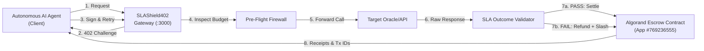

# SLAShield402

> Autonomous x402 AI Payment Firewall, Real-Time SLA Validator & Conditional Algorand Smart Contract Escrow Layer.

## What is this?

**SLAShield402** is an agentic payment infrastructure gateway that sits between autonomous AI agents and paid external APIs. It solves two critical production risks in agentic commerce: **wallet depletion from unexpected price spikes**, and **financial loss from paying upfront for stale, malformed, or slow API responses**.

Using the **x402 payment protocol** on **Algorand Testnet**, SLAShield402 enforces pre-flight spend policy limits, measures real-time response SLAs (Freshness, Format, Latency), and coordinates conditional smart contract escrow settlements with automated 10% provider bond slashing when quality guarantees are broken.

---

## How It Works

```txt
[AI Agent] ──1. POST /shield/check (Unpaid)──> [SLAShield402 Gateway]
   ▲                                                    │
   │ ◄──2. HTTP 402 + USDC Challenge────────────────────┘
   │
   ├──3. Sign USDC ASA Tx + Retry with X-Payment-Proof──> [Spend Policy Gate]
                                                                │
                                              4. Outgoing Call  │ (if Approved)
                                                                ▼
[Algorand Escrow Contract] ◄──6. Settle or Refund── [SLA Validator] ◄──5. Upstream Data── [Target API]
   (App ID #769236555)                               (Freshness, Format, Latency)
```

1. **Pre-flight Firewall Gate:** Evaluates agent budget caps and provider authorization before funds leave the wallet.
2. **x402 Challenge & Client Signing:** Returns `HTTP 402 Payment Required`; client dynamically signs and broadcasts a fresh USDC ASA payment on Algorand Testnet.
3. **Outgoing API Execution & Timing:** Executes upstream call and records sub-second roundtrip network latency.
4. **Real-Time SLA Validation:** Evaluates response JSON syntax, data timestamp freshness ($\le 60$s), and latency thresholds ($\le 5$s).
5. **Conditional Escrow Settlement & Slashing:**
   - **SLA PASS:** Smart contract triggers `approve_and_settle`, releasing payment to the provider.
   - **SLA FAIL:** Smart contract triggers `fail_and_refund`, instantly refunding the agent and slashing the provider's bonded stake by 10%.

---

## Architecture

See [`ARCHITECTURE.md`](./ARCHITECTURE.md) for detailed sequence flows and component specifications.



---

## Tech Stack

| Layer | Technology | Role |
|---|---|---|
| **Payment Protocol** | `x402` (`exact` scheme, USDC on Algorand Testnet) | Standardized HTTP 402 negotiation and client headers |
| **Client Signer** | `@x402/fetch` / `algosdk` (`v3.2.0`) | Dynamic client-side USDC ASA transaction construction and signing |
| **Resource Gateway** | `@x402/hono` / `@x402/avm` (`v2.19.0`) | High-performance HTTP server with CAIP-2 network verification |
| **Discovery Extension** | `@x402-avm/extensions` (`v2.6.1`) | Exposes machine-readable Bazaar metadata on `GET /api/discovery` |
| **Smart Contract Escrow** | PyTeal / Algorand AVM (`App ID #769236555`) | Conditional escrow settlement and provider bond slashing logic |
| **Facilitator Choice** | **Custom Two-Phase Escrow vs. GoPlausible Facilitator** | *Architectural Rationale:* Hosted facilitators (like GoPlausible) execute immediate `/settle` upfront before data is delivered. SLAShield402 routes through a two-phase smart contract escrow to enable post-response SLA validation and bond penalties. |
| **Frontend Dashboard** | React / Vite / TailwindCSS / Lucide Icons | Apple-style real-time telemetry dashboard with WebSocket streaming |

---

## Setup & Running Locally

### 1. Clone & Install Dependencies
```bash
git clone https://github.com/Vishal-VK18/SLAShield402.git
cd SLAShield402
npm install
pip install -r person-3-algorand-contract/requirements.txt
```

### 2. Configure Environment
```bash
cp .env.example .env
# Ensure DEPLOYER_MNEMONIC, ALGOD_SERVER, and APP_ID (769236555) are set
```

### 3. Fund Testnet Wallet & Opt In
1. Fund with Testnet ALGO: [Lora Dispenser](https://lora.algokit.io/testnet/fund)
2. Opt in to USDC ASA ID `10458941`:
```bash
python person-3-algorand-contract/scripts/optInUsdc.py
```

### 4. Run the Full Stack
```bash
# Starts both Firewall Gateway (:3000) and Real-Time Dashboard (:5173)
npm run dev:full
```

### 5. Run the Automated Live Demo
```bash
npm run demo
```

---

## Pricing

| Endpoint / Action | Price | Description |
|---|---|---|
| `POST /shield/check` | 0.001 USDC | Pre-flight firewall inspection, SLA verification & escrow guarantee fee |
| `GET /api/discovery` | Free ($0.00) | Public Bazaar discovery catalog metadata for agent crawlers |
| `GET /api/events/recent` | Free ($0.00) | Recent execution events and telemetry backlog |

---

## Live On-Chain Proofs (Algorand Testnet)

| Flow | Transaction ID | Confirmation Round | Pera Explorer Link |
|---|---|:---:|---|
| **Fresh USDC ASA Client Sign** | `7DDDB4OSEYWCLBKZV23BXVUQTEBSSLIE2EALXJARQAUQ2QJCFAOQ` | 66487818 | [View Tx](https://testnet.explorer.perawallet.app/tx/7DDDB4OSEYWCLBKZV23BXVUQTEBSSLIE2EALXJARQAUQ2QJCFAOQ/) |
| **Scenario 1: SLA Pass Settlement** | `DWR5KCQPJMCTRNFKRJNKZE7VD6HK5YMRI2RCKAUWNMGONDVHZUTA` | 66487820 | [View Tx](https://testnet.explorer.perawallet.app/tx/DWR5KCQPJMCTRNFKRJNKZE7VD6HK5YMRI2RCKAUWNMGONDVHZUTA/) |
| **Scenario 3: Refund & Bond Slash** | `KXZXOGNHT7BGUOH6JPFVFULVIOD7H6AGGVYKIVRSIWORYDSMSE4Q` | 66487823 | [View Tx](https://testnet.explorer.perawallet.app/tx/KXZXOGNHT7BGUOH6JPFVFULVIOD7H6AGGVYKIVRSIWORYDSMSE4Q/) |

---

## What's Next (Mainnet Readiness)

To transition from Algorand Testnet to Mainnet:
1. Switch CAIP-2 network identifier to Mainnet (`algorand:wGHE2Pwdvd7S12BL5FaOP20EGYesN73ktiC1qzkkit8=`).
2. Update USDC Asset ID to Mainnet (`31566704`).
3. Transition client signing from `.env` mnemonic to a secure HSM or Web3 Agent Key Management Service (e.g. Turnkey/Privy).
4. Persist consumed transaction nonces in Redis with TTLs for distributed replay protection.

---

## Team

- **Vishal D & Team SLAShield402** — Web3 & AI Agents Engineers.
